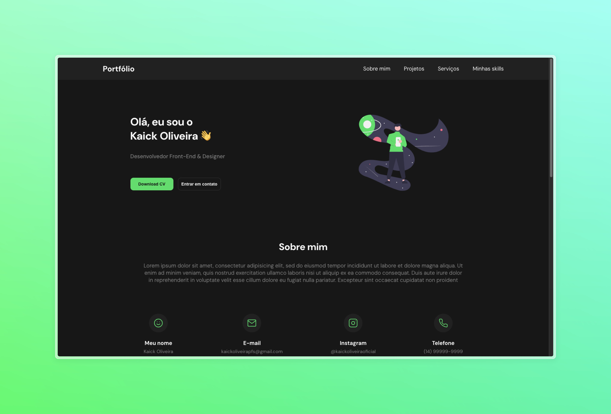

<h1 align="center"> Portfolio Model 01 </h1>

 

  <a href="#-tecnologias">Tecnologias</a>&nbsp;&nbsp;&nbsp;|&nbsp;&nbsp;&nbsp;
  <a href="#-projeto">Projeto</a>&nbsp;&nbsp;&nbsp;|&nbsp;&nbsp;&nbsp;
  <a href="#-layout">Layout</a>&nbsp;&nbsp;&nbsp;|&nbsp;&nbsp;&nbsp;
  <a href="#memo-licença">Licença</a>

  

 

  

## 🚀 Tecnologias

Esse projeto foi desenvolvido com as seguintes tecnologias:

- HTML
- Css
- JavaScript
- Figma

## 💻 Projeto

- [Acesse o projeto finalizado, online](https://kaickoliveiraoficial.github.io/portfolio-model-01/)

## 🔖 Layout

Você pode visualizar o layout do projeto através [DESSE LINK](https://www.figma.com/design/5m6VjGlKIF16rJiBEDPUSl/Codel%C3%A2ndia---Desafio-9?t=C6eygoVTiZZzi4bS-0). É necessário ter conta no [Figma](https://figma.com) para acessá-lo.

## :memo: Licença

Esse projeto está sob a licença MIT.

---

By Kaick Oliveira :wave:
